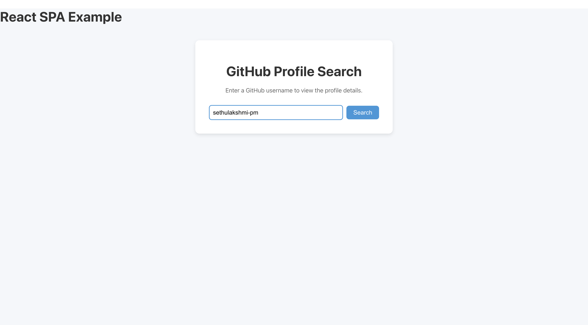
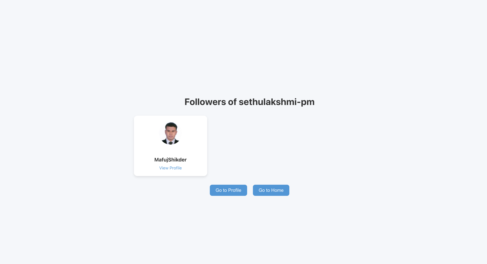
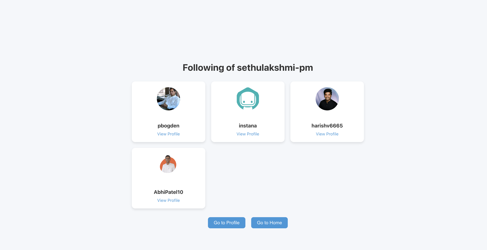
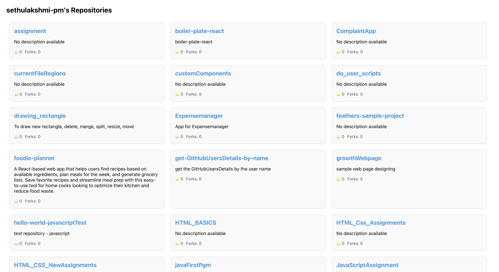

# Getting Started with Create React App

GitHubFinder - https://gitprofilessearch.netlify.app/

## Available Scripts

To run this Project:

### `npm install` to install the node_modules

### `npm start` to run this project.

Runs the app in the development mode.\
Open [http://localhost:3000](http://localhost:3000) to view it in your browser.

To test this Project:

### `npm test`

Launches the test runner in the interactive watch mode.\
See the section about [running tests](https://facebook.github.io/create-react-app/docs/running-tests) for more information.

To build this Project:
### `npm run build`

### Deployment

[Using Netlify..!!](https://app.netlify.com/sites/gitprofilessearch/overview)

# Description - [gitprofilessearch](https://gitprofilessearch.netlify.app/)

- **Type of App**: Single Page Application (SPA) built with React.
- **Main Feature**: Allows users to search for GitHub user details.
- **Home Page**: 
  - Contains a search bar where users can input a **GitHub user ID**.
  - On submitting the user ID, the app fetches data from the GitHub API.
  
- **Fetched Information**: 
  - Displays basic user information such as:
    - **User's name**
    - **Profile picture**
    - **Bio**
    - **Public repositories count**
    - **Followers count**
    - **Following count**
  
- **Additional Features**:
  - **Followers**: Shows the list of the user's followers.
  - **Repositories**: Displays the user's public repositories with details like name, description, and stars.
  - **Following**: Lists the users that the searched GitHub user is following.

- **User Interaction**:
  - Users can click through the fetched details to explore the follower's profiles, repos, or the profiles of users they are following.

- **Data Source**: GitHub API (public data).

- Sethulakshmi P M.